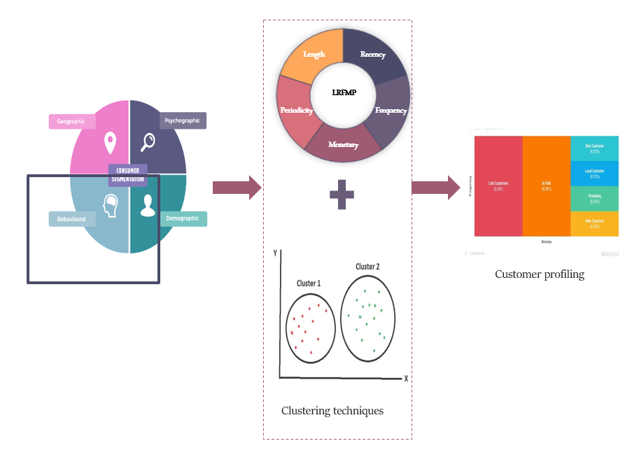

# Master thesis - Customer segmentation using LRMFP model in e-commerce industry

Participants : Sowmya Ashok Kumar. Lipika Chakravarti

Supervised By : Muhammad Afzaal, PHD, Stockholm University (https://github.com/muhammadafzaal)

Summary:
The research focuses on implementing customer segmentation using the LRFMP model and advanced clustering techniques in e-commerce. Two datasets, UK Online Retail and H&M Online Retail, are analyzed to study the impact of dataset volume on model selection. The results reveal effective clustering using RM with K-means and Agglomerative algorithms for the UK dataset, and RL with K-means and BIRCH algorithms for the H&M dataset. Including L and P variables in the RFM model doesn't consistently improve clustering outcomes, indicating variable influence based on dataset characteristics. These findings provide valuable insights for personalized marketing and improved customer engagement in e-commerce.

 UK dataset: https://www.kaggle.com/datasets/ulrikthygepedersen/online-retail-dataset
 
 HM dataset: https://www.kaggle.com/competitions/h-and-m-personalized-fashion-recommendations/data?select=transactions_train.csv
 
 
 
 
 
 

 
 

